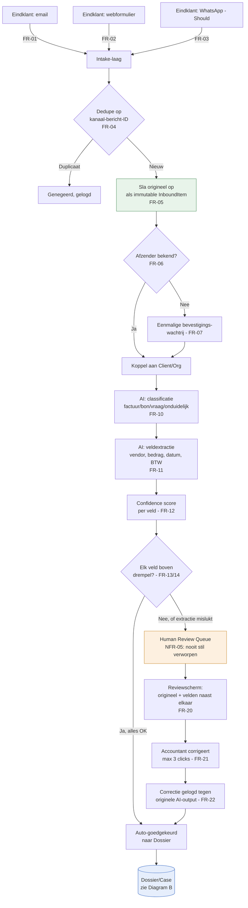
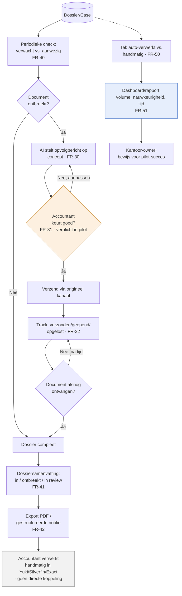
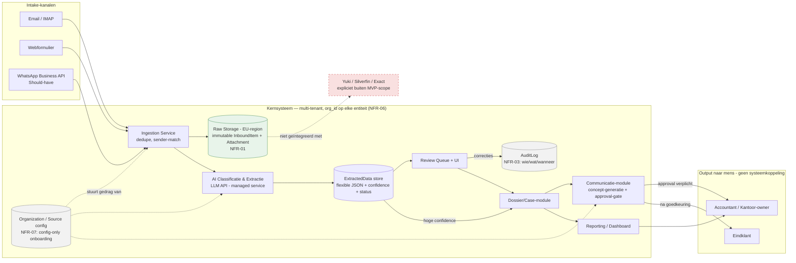

# SE Lifecycle — Fase 1: System Flow & Architectuurdiagrammen
### AI-diensten voor Boekhoudkantoren — MVP/Pilot

Bouwt voort op `01-requirements-en-storyboards.md`. Diagrammen zijn in Mermaid-syntax — te renderen in VS Code (Mermaid-extensie), GitHub, Obsidian, of via mermaid.live. Elk diagram verwijst naar de requirement-ID's die het dekt.

---

## Diagram A — System Flow: Intake → Classificatie → Review

**Dekt:** FR-01–07, FR-10–15, FR-20–22, NFR-05

**Ontwerpnotitie:** de tak "extractie mislukt" (K → M) is bewust dezelfde queue als lage confidence — er is geen apart foutpad, precies om NFR-05 (nooit stil verworpen) af te dwingen zonder een tweede foutafhandelingssysteem te bouwen.

---

## Diagram B — System Flow: Opvolging & Dossiervoorbereiding

**Dekt:** FR-30–32, FR-40–42, FR-50–51

**Ontwerpnotitie:** het blok `AC` (verwerking in Yuki/Silverfin/Exact) staat bewust buiten dit systeem getekend — er loopt geen pijl terug het systeem in. Dat is de expliciete MVP-grens uit sectie 6/8 van de requirements: geen API-koppeling naar de kantoorsoftware.

---

## Diagram C — High-Level Architectuur (MVP)

**Dekt:** NFR-01, NFR-02, NFR-03, NFR-06, NFR-07, sectie 6 (Integratie)

**Ontwerpnotities:**

- Alle datastores (`RAW`, `EXT`, `AUD`, `CFG`) liggen binnen de multi-tenant kernsysteem-grens, EU-hosted (NFR-01). Fysieke scheiding tussen `RAW` (immutable, ongewijzigd) en `EXT` (AI-interpretatie) is een architecturale hardheid, geen implementatiedetail — dit staat letterlijk in sectie 8 van het project-overzicht als vastgelegde beslissing.
- `CFG` (Organization/Source-config) stuurt drie andere componenten aan (ingestion-regels, confidence-drempels, communicatie-kanalen) zonder dat er per kantoor code wordt geschreven — dit is de architecturale vertaling van NFR-07.
- De koppeling naar Yuki/Silverfin/Exact is expliciet getekend als *niet bestaand* (stippellijn, rode kleur) om te voorkomen dat een toekomstige lezer van dit diagram die integratie per ongeluk als "gepland" interpreteert.
- Een DPA/verwerkersovereenkomst (NFR-02) is geen technisch blok in dit diagram, maar een randvoorwaarde die vóór elk `E1/E2/E3`-kanaal live gaat voor een kantoor geregeld moet zijn — vermeld hier voor volledigheid, niet als systeemcomponent.

---

## 4. Wat deze diagrammen bewust niet vastleggen

Conform de open vragen in het project-overzicht (sectie 9):

- **Auto-match vs. human-confirm** bij eerste afzendercontact is in Diagram A getekend als expliciete keuze (`E`), maar het exacte gedrag na de eerste keer (blijvend auto-matchen?) is niet vastgelegd — dit is een configuratieparameter, geen architectuurkeuze.
- **Confidence-drempelwaarden** zijn in Diagram A getekend als beslispunt (`K`), niet als vaste waarde — de drempel zelf is per kantoor/veldtype instelbaar (FR-14) en wordt pas na echte pilotdata getuned.
- **WhatsApp (E3)** staat in Diagram C als kanaal getekend maar gemarkeerd Should-have — bouwvolgorde-beslissing, geen architecturale onzekerheid.

---

## 5. Suggestie voor volgende SE-lifecycle stap

Met requirements, storyboards en diagrammen op tafel is de logische vervolgstap een **data-model / entiteitendiagram** (Organization, Source, InboundItem, Attachment, ExtractedData, Client, Case, Action, AuditLog — sectie 5 van de requirements-analyse) en een **API/interface-schets** per module, vóór er code geschreven wordt. Zeg het maar als je daarmee wil verdergaan.
