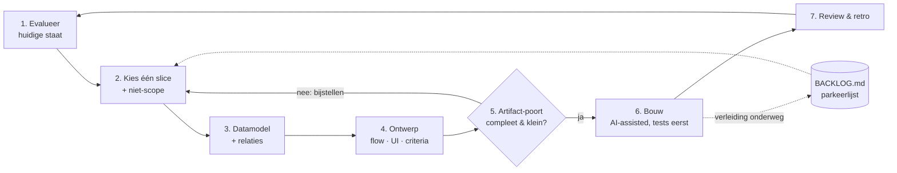

# BoekVastAI — Feature-cyclus

Eén doorlopende, herhaalbare cyclus per feature-slice. Doel: nooit meer feature creep —
elke cyclus levert één klein, afgerond, gereviewd stuk werkende software op, met
lichte artifacts die een toekomstige sessie (mens of AI) meteen op snelheid brengen.

**Uitvoeren:** start de `feature-cycle` skill in Claude Code (`/feature-cycle`). De skill
leest de actieve cyclus uit `docs/features/` en gaat verder waar je zat.

---

## De cyclus



| Fase | Vraag | Output |
|---|---|---|
| 1. Evalueer | Waar staat de app écht? | `docs/STATE.md` (vers overschreven; git bewaart historiek) |
| 2. Kies | Wat is de kleinste slice met de meeste pilotwaarde? | `docs/features/<slug>/brief.md` — mét expliciete niet-scope |
| 3. Datamodel | Welke entiteiten/relaties, oud én nieuw? | `docs/features/<slug>/data-model.md` |
| 4. Ontwerp | Hoe stroomt het, hoe ziet het eruit, wanneer is het af? | flow + acceptatiecriteria in de brief |
| 5. Poort | Zijn de artifacts compleet en past de slice in de timebox? | go / terug naar 2 / stop (goedkoop stoppen kan hier nog) |
| 6. Bouw | Tests eerst, kleine commits, FR-id's in messages | werkende code + groene checks |
| 7. Review | Haalt het de acceptatiecriteria? Wat leren we? | `docs/features/<slug>/review.md` + retro → voedt fase 1 |

## Agile spelregels

1. **Eén slice per cyclus.** Past de bouw niet in de timebox (richtlijn: 1–2 gefocuste
   sessies), dan is de slice te groot — splits hem in fase 2, niet onderweg.
2. **Bijsturen mag altijd, stilzwijgend groeien nooit.** Elke scopewijziging wordt één
   regel in het beslissingenlog van de brief. Nieuwe ideeën gaan naar
   `docs/BACKLOG.md` — dat is het ventiel, niet de branch.
3. **Elke fase mag terugsturen.** Ontdek je in fase 6 dat het datamodel wringt: terug
   naar fase 3, log de beslissing, ga door. De cyclus is een lus, geen waterval.
4. **Artifacts zijn éénpagina's.** Brief, datamodel en review passen elk op één pagina.
   Word je langdradig, dan is de slice te groot of het denkwerk nog niet af.
5. **De poort (fase 5) is heilig.** Geen code vóór brief + datamodel + acceptatiecriteria
   er staan. Dit is het goedkoopste moment om te stoppen of te krimpen.
6. **Hervatbaar.** De cyclus-status leeft in de brief-frontmatter (`status:`), niet in
   iemands hoofd. Elke sessie kan verder waar de vorige stopte.
7. **Harde kaders blijven CLAUDE.md §3/§4** (multi-tenant, raw/extracted, FR-31-poort,
   out-of-scope-lijst). Een slice die daarmee botst stopt in fase 2, niet in fase 6.

## Mappenstructuur

```
docs/
  WORKFLOW.md            ← dit document
  STATE.md               ← laatste evaluatie (fase 1)
  BACKLOG.md             ← parkeerlijst, gescoord in fase 2
  features/
    _template/           ← kopieer bij start van een cyclus
      brief.md
      data-model.md
      review.md
    <slug>/              ← één map per cyclus = het cycluslog
```
