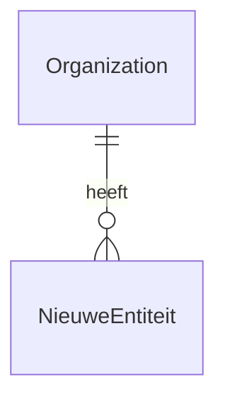

# Datamodel — <featurenaam>

## Nieuwe / gewijzigde entiteiten

| Entiteit | Nieuw/wijziging | Velden (kern) | Opmerking |
|---|---|---|---|
| | | | |

## Relaties (oud ↔ nieuw)

## Toets aan CLAUDE.md §3 (verplicht, per entiteit)

- [ ] `org_id` op elke nieuwe entiteit; elke query org-gescoped (NFR-06)
- [ ] Raakt niets aan raw intake-data; AI-interpretatie blijft in aparte tabellen
- [ ] Flexibele velden als JSON waar structuur per document/type verschilt
- [ ] Geen per-kantoor conditionals — kantoorverschillen in config (NFR-07)
- [ ] Foutpaden landen zichtbaar bij een mens (NFR-05)
- [ ] Outbound? Dan achter de goedkeuringspoort (FR-31)

## Migratie-impact

<Nieuwe tabellen / kolommen op bestaande tabellen / seed-reset nodig? Alembic-stap?>
